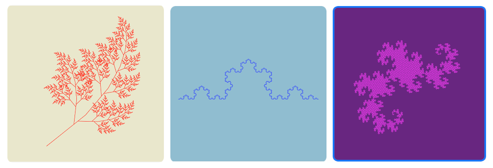
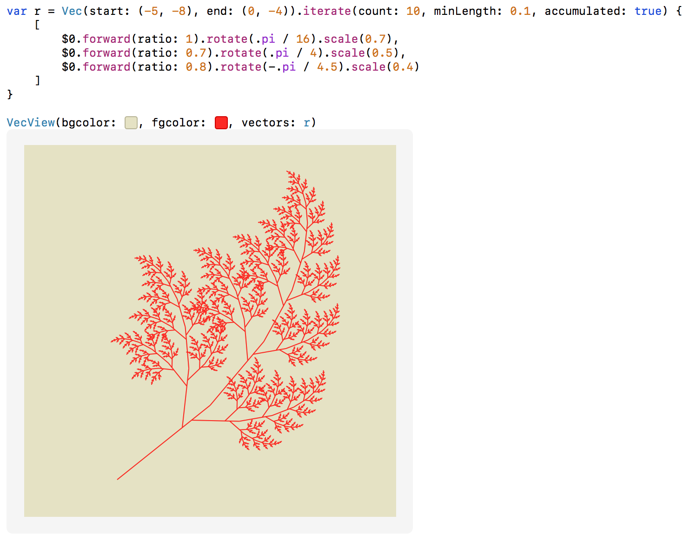
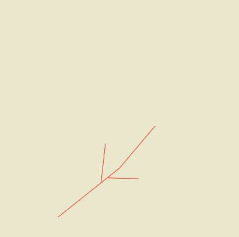

# Iterated Function Systems (IFS)

This Swift playground demonstrates the basic idea about *Iterated Function Systems* (IFS) fractals. Here are some examples:

😉 For more information about IFS, please check:
[Wikipedia - Iterated Function Systems](https://en.wikipedia.org/wiki/Iterated_function_system).

## Use

Open in *Xcode 9* on macOS or in latest *Swift Playgrounds* app on iPad.

## How it works

To create a IFS factal, you only need two things:
1. an initial *line segement* (viz. *vector* or `Vec` in code), which has a start point and an end point.
2. a *transformation rule* that turns one *line segement* into many.

In the example above, `Vec(start: (-5, -8), end: (0, -4))` is the initial vector, which makes the trunk of the tree. Then we have a rule (the array in code) says "turns the trunk into three branches". The rule will be iterated on each branches again and again. Finally we get the whole tree 🌲.

You can also set different *iteration count* in `iterate` function to observe the process of growth 👍:

## Limitation

This playground only draws 2D line segements but IFS fractal is much more than that.

## Contact

gong@me.com
